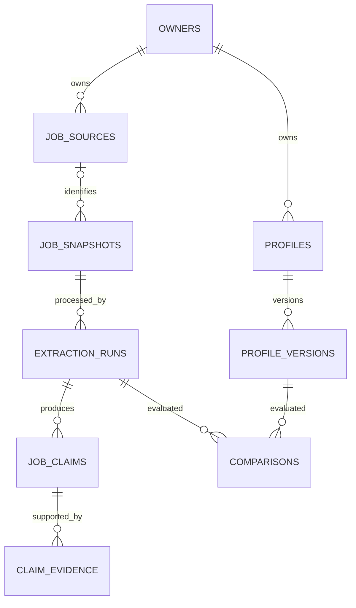

# Career Intelligence OS — Data Model Proposal

[English](#english) | [Português](#português)

## English

### Status and scope

Proposal for review, aligned with [product-requirements.md](product-requirements.md). No migration, application change, agent, model provider or RAG integration is implemented by this document.

Use the existing local PostgreSQL database with a separate `career` schema. Keep AgentOS runtime tables and the infrastructure persistence probe separate. pgvector remains available, but no embeddings or vector tables are needed in this phase.

### Proposed entities

All entity identifiers are UUIDs. Creation times use timezone-aware timestamps. Private records carry an `owner_id`; profile-specific records also identify their profile.

| Entity | Purpose and principal fields |
|---|---|
| `owners` | Data ownership boundary: `id`, optional local display label, `created_at`. This is not a login account or authentication system. |
| `profiles` | Stable profile identity: `id`, `owner_id`, label, `created_at`, `archived_at`. One owner may have several scenarios. |
| `profile_versions` | Immutable preferences at a point in time: `id`, `owner_id`, `profile_id`, sequential version, validated `preferences_json`, schema version, `created_at`. |
| `job_sources` | Manually supplied source identity: `id`, `owner_id`, source kind, optional URL and external posting identifier. URL matching must be confirmed; an unconfirmed URL is not a verified link. |
| `job_snapshots` | Immutable original input: `id`, `owner_id`, optional source ID, exact text, content hash, capture time if known, import time, language, source-association status. |
| `extraction_runs` | Versioned processing: `id`, `owner_id`, snapshot ID, extractor version, optional provider/model identifiers, status, start/completion times. Manual structured entry is an acceptable initial extractor. |
| `job_claims` | Extracted assertions: `id`, `owner_id`, extraction ID, controlled field key, typed JSON value, knowledge status, requirement strength where relevant. Multiple claims for one field preserve contradictions. |
| `claim_evidence` | Supporting text: `id`, `owner_id`, claim ID, exact excerpt, start/end character offsets and source section where known. |
| `comparisons` | Immutable result for one profile version and extraction: `id`, `owner_id`, profile-version ID, extraction ID, rules version, overall eligibility, result details, `created_at`. |

Foreign keys must ensure references belong to the same owner. Use owner-qualified references and uniqueness constraints rather than trusting IDs received from a client. Version numbers are unique within a profile. Evidence must belong to the same snapshot as its extraction.

### Relationships

### Preference structure

Use validated JSON for evolving profile preferences, not arbitrary unchecked data. Keep ownership, relations, versions and timestamps in relational columns. Explicitly version the JSON contract.

- Current location: country code, region, city and optional commute area.
- Global constraints/preferences: employer countries, career interests and documented skill/experience entries with their provenance.
- Accepted pathways: a list of alternatives, each with an ID, location/destination, work arrangements, relocation conditions, travel, self-declared work authorization, sponsorship need, contracts and compensation preferences.
- Each criterion distinguishes `required`, `preferred`, `unrestricted` and `unspecified`. Empty values must not silently mean either unrestricted or incompatible.
- Compensation distinguishes advertised versus required actual payment currency, period, numeric range and gross/net basis. No automatic net/gross or currency conversion without an explicit conversion policy.

Within one pathway, required criteria combine with AND. Pathways combine with OR. Global required criteria apply to every pathway. Missing location or an empty pathway list must trigger incomplete-profile handling, not a vacuous compatible result.

Profiles and versions have no hardcoded country, currency, contract or occupation values. Country and currency codes are reference data, not defaults.

### Claim and evidence contract

Controlled field keys include advertised title, described role title, employer, employer country, location, work arrangement, allowed work countries, contract, working-time basis, sponsorship, authorization restrictions, experience, education, skills and compensation. Validate each value according to its field's schema.

Knowledge states are `explicit`, `inferred` and `not_provided`. Contradiction is a relationship between claims, not a replacement for the original claims. An explicit claim requires exact supporting evidence; an inference requires its basis and explanation; a not-provided claim has no invented value and records that the field was inspected.

For salary, preserve each range independently with amount, currency, period, gross/net basis if known, and source section. Preserve skill groups such as “TARA, PSS/E or similar” as alternatives rather than converting them into three independent mandatory requirements.

Evidence offsets are zero-based Unicode character positions in the unchanged snapshot text, with an exclusive end. Validate that the excerpt equals the indicated text slice. Do not normalize the source text after recording offsets.

An inference may inform discussion, but cannot by itself prove a mandatory eligibility criterion. Missing, ambiguous or conflicting evidence yields `needs_confirmation` unless an independent explicit restriction establishes incompatibility.

### Comparison contract

Store per-criterion results with pathway ID, criterion key/strength, `compatible`, `incompatible` or `needs_confirmation`, explanation and supporting claim IDs. Technical fit is separate and may be `not_assessed`.

For a pathway: an explicit mandatory conflict means incompatible; otherwise unresolved mandatory evidence means needs confirmation; otherwise compatible. For alternatives: any compatible pathway is sufficient; all incompatible means incompatible; other cases need confirmation. Apply global mandatory constraints as well.

No configured eligibility restrictions means “no configured restrictions”, not proof of authorization to work. A prior comparison remains tied to its immutable profile version, extraction and rules version. Editing a profile or re-extracting a snapshot creates a new comparison; old results are not silently rewritten. No hiring-probability field is proposed.

### Storage, access and deduplication

Store private records in PostgreSQL on the existing persistent Docker volume. Do not publish real profiles, source documents or records in Git; use synthetic fixtures. Owner IDs alone do not provide secure multi-user access: before shared deployment, authentication must determine the owner and authorization must enforce it on every operation.

A text hash only detects identical text within an owner's data; it does not prove two postings are the same job. Reuse a confirmed source identity when available, but preserve distinct captures and extraction history. Do not deduplicate across owners or merge jobs using title alone.

Index owner-qualified foreign keys and common access paths, including owner/profile versions, owner/source captures and owner/comparison history. Add JSON indexes only for demonstrated query needs. Define private export, deletion and backup procedures before handling shared production data; historical versioning must not prevent deletion of personal data.

### Implementation order and review gates

1. Approve this model and define typed preference, claim and result contracts with synthetic examples.
2. Add versioned migrations to the existing database. Do not rely on initialization SQL to upgrade an already initialized volume or delete the volume to apply changes.
3. Implement local profile entry and manual vacancy import. Start with structured manual claims and deterministic comparison rules; choose an AI extractor separately if useful.
4. Verify isolation, evidence slices, conflicting salaries, unknowns, alternative pathways and persistence after restart.
5. Only then consider automated extraction, agents or RAG under separate approval.

Decisions still requiring review: profile entry interface, country/region normalization, precise contract categories, skill/experience evidence structure, migration tooling and access model. This document proposes the design; it does not authorize code or database changes.

---

## Português

### Estado e escopo

Proposta para revisão, alinhada a [product-requirements.md](product-requirements.md). Este documento não implementa migration, alteração na aplicação, agente, provedor de modelos ou integração RAG.

Usar o PostgreSQL local existente com schema `career` separado. Preservar as tabelas do runtime AgentOS e o teste de persistência da infraestrutura em seus espaços. pgvector continua disponível, mas esta fase não precisa de embeddings ou tabelas vetoriais.

### Entidades propostas

Identificadores de entidades são UUIDs. Datas de criação usam timestamps com fuso. Registros privados têm `owner_id`; registros específicos de perfil também identificam o perfil.

| Entidade | Finalidade e campos principais |
|---|---|
| `owners` | Limite de propriedade dos dados: `id`, rótulo local opcional e `created_at`. Não representa login nem autenticação. |
| `profiles` | Identidade estável do perfil: `id`, `owner_id`, rótulo, `created_at`, `archived_at`. Uma pessoa pode ter vários cenários. |
| `profile_versions` | Preferências imutáveis por versão: `id`, `owner_id`, `profile_id`, versão sequencial, `preferences_json` validado, versão do schema e `created_at`. |
| `job_sources` | Identidade da fonte fornecida manualmente: `id`, `owner_id`, tipo, URL e identificador externo opcionais. A associação com a URL precisa ser confirmada. |
| `job_snapshots` | Entrada original imutável: `id`, `owner_id`, fonte opcional, texto exato, hash, data de captura se conhecida, data de importação, idioma e estado da associação com a fonte. |
| `extraction_runs` | Processamento versionado: `id`, `owner_id`, snapshot, versão do extrator, provedor/modelo opcionais, estado e datas. Cadastro estruturado manual é um extrator inicial aceitável. |
| `job_claims` | Afirmações extraídas: `id`, `owner_id`, extração, chave controlada de campo, valor JSON tipado, estado de conhecimento e força do requisito quando aplicável. Múltiplas afirmações preservam contradições. |
| `claim_evidence` | Trechos de apoio: `id`, `owner_id`, afirmação, trecho exato, posições inicial/final e seção da fonte quando conhecida. |
| `comparisons` | Resultado imutável de uma versão de perfil e extração: `id`, `owner_id`, versão do perfil, extração, versão das regras, elegibilidade geral, detalhes e `created_at`. |

Chaves estrangeiras devem garantir referências do mesmo proprietário. Usar referências qualificadas por proprietário e restrições de unicidade, sem confiar apenas em IDs recebidos do cliente. Versões são únicas dentro de um perfil. Evidências devem pertencer ao mesmo snapshot da extração.

O diagrama na seção em inglês mostra as relações: proprietário → perfis → versões; fontes → snapshots → extrações → afirmações → evidências; versões de perfil e extrações → comparações.

### Estrutura de preferências

Usar JSON validado para preferências que evoluem, não dados arbitrários sem contrato. Propriedade, relações, versões e timestamps ficam em colunas relacionais. Versionar explicitamente o contrato JSON.

- Localização atual: código do país, região, cidade e área de deslocamento opcional.
- Restrições/preferências globais: países das empresas, interesses profissionais e habilidades/experiência documentadas com sua origem.
- Caminhos aceitos: alternativas, cada uma com ID, localização/destino, modalidades, condições de mudança, viagens, autorização declarada, necessidade de sponsor, contratos e remuneração.
- Cada critério diferencia `required`, `preferred`, `unrestricted` e `unspecified`: obrigatório, preferencial, sem restrição e não especificado. Valores vazios não significam automaticamente sem restrição nem incompatibilidade.
- Remuneração diferencia moeda anunciada e exigência de moeda efetiva de pagamento, período, faixa numérica e base bruta/líquida. Não converter moeda ou bruto/líquido sem política explícita.

Critérios obrigatórios de um caminho combinam com E. Caminhos combinam com OU. Restrições globais obrigatórias valem para todos. Localização ausente ou lista de caminhos vazia deve indicar perfil incompleto, não compatibilidade automática.

Nenhum país, moeda, contrato ou profissão fica fixado como preferência no código. Códigos de país e moeda são dados de referência, não padrões.

### Contrato de afirmações e evidências

Chaves controladas incluem título anunciado, cargo descrito, empresa, país da empresa, localização, modalidade, países permitidos para trabalhar, contrato, jornada, sponsor, restrições de autorização, experiência, formação, habilidades e remuneração. Validar cada valor conforme o schema do campo.

Estados de conhecimento: `explicit`, `inferred` e `not_provided` — explícito, inferido e não informado. Contradição é uma relação entre afirmações, sem substituir os fatos originais. Afirmação explícita exige evidência exata; inferência exige base e justificativa; não informado não inventa um valor e registra que o campo foi inspecionado.

Para salário, preservar cada faixa com valor, moeda, período, base bruta/líquida se conhecida e seção da fonte. Grupos como “TARA, PSS/E ou similar” permanecem alternativas, sem virarem três requisitos obrigatórios independentes.

Posições dos trechos são contadas por caracteres Unicode, começando em zero, com posição final exclusiva, no texto inalterado. Validar que o trecho corresponde ao recorte indicado. Não normalizar o texto original depois de registrar posições.

Inferência pode informar a discussão, mas não comprova sozinha elegibilidade obrigatória. Evidência ausente, ambígua ou conflitante gera `needs_confirmation`, salvo restrição explícita independente que estabeleça incompatibilidade.

### Contrato de comparação

Guardar resultados por critério com ID do caminho, chave/força do critério, `compatible`, `incompatible` ou `needs_confirmation`, justificativa e IDs das afirmações utilizadas. Aderência técnica fica separada e pode ser `not_assessed`.

Em um caminho: conflito obrigatório explícito significa incompatível; caso contrário, evidência obrigatória pendente significa precisa confirmar; caso contrário, compatível. Nas alternativas: qualquer caminho compatível basta; todos incompatíveis significa incompatível; outros casos precisam confirmar. Aplicar também as restrições globais obrigatórias.

Ausência de restrições configuradas significa “sem restrições configuradas”, não prova de autorização de trabalho. Uma comparação permanece vinculada à versão imutável do perfil, extração e regras. Editar perfil ou reextrair um snapshot cria nova comparação; não reescreve silenciosamente resultados anteriores. Não há campo de probabilidade de contratação proposto.

### Armazenamento, acesso e deduplicação

Guardar registros privados no PostgreSQL do volume Docker persistente. Não publicar perfis reais, documentos-fonte ou registros no Git; usar exemplos fictícios. IDs de proprietário não garantem acesso multiusuário seguro: antes de implantação compartilhada, autenticação deve determinar o proprietário e autorização deve verificá-lo em cada operação.

Hash detecta texto idêntico dentro dos dados de um proprietário; não comprova que dois anúncios são a mesma vaga. Reutilizar identidade de fonte confirmada quando disponível, preservando capturas e histórico de extração. Não deduplicar entre proprietários nem juntar vagas somente pelo título.

Indexar chaves estrangeiras qualificadas por proprietário e acessos frequentes: versões de perfil, capturas por fonte e histórico de comparação. Adicionar índices JSON apenas conforme consultas comprovadas. Definir exportação privada, exclusão e backup antes de dados compartilhados de produção; histórico não pode impedir exclusão de dados pessoais.

### Ordem de implementação e revisão

1. Aprovar o modelo e definir contratos tipados de preferências, afirmações e resultados com exemplos fictícios.
2. Adicionar migrations versionadas ao banco existente. SQL de inicialização não atualiza automaticamente volumes inicializados; não apagar o volume para aplicar mudanças.
3. Implementar cadastro local de perfil e importação manual de vagas. Começar com afirmações estruturadas manualmente e regras determinísticas; decidir separadamente sobre extrator com IA.
4. Verificar isolamento, trechos de evidência, salários conflitantes, desconhecidos, caminhos alternativos e persistência após restart.
5. Somente depois considerar extração automática, agentes ou RAG sob aprovação separada.

Decisões para revisão: interface de cadastro, normalização geográfica, categorias de contrato, evidências de habilidades/experiência, ferramenta de migrations e modelo de acesso. Este documento propõe o desenho; não autoriza alterar código ou banco.
